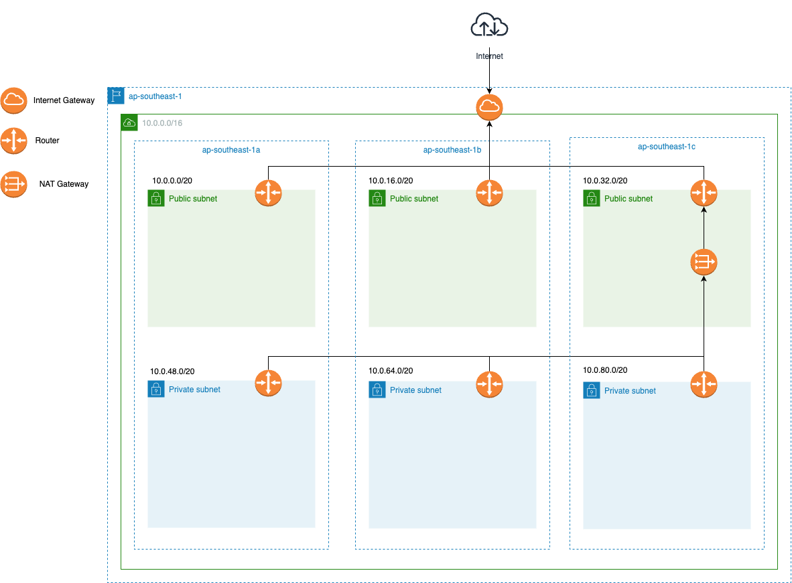

# AWS Terraform Module

This module handles the creation of VPC, EC2, ECR, and EKS resources on AWS using Terraform.

# Prerequisites

- AWS account
- AWS CLI installed and configured
- Terraform 1.9.3 installed
# Architecture
## Infrastructure


# Modules

- **VPC**: The module provisions a VPC with the necessary subnets, gateway, and route tables.
- **EC2**: The module creates an EC2 instance.
- **ECR**: The module sets up an Elastic Container Registry.
- **EKS**: The module creates an Elastic Kubernetes Service cluster.

# Resources Created

This module will create:

- A VPC with necessary subnets, gateway, nat gateway, and route tables
- EC2 instance
- ECR repository
- An EKS cluster
- 2 Worker Nodes.
- A Jenkins EC2 instance with:
   - Docker
   - AWS-CLI
   - Kubectl

# Configuration

## Variables
You can define variables in a `terraform.tfvars` file or at the CLI. Below are the expected variables:

- `region`: AWS region (e.g., "ap-southeast-1")
- `vpc_base_name`: Basename for the VPC
- `cidr_block`: The CIDR block for the VPC
- `availability_zones`: Availability zones for the subnets
- `public_subnet_ips`: IP ranges for the public subnets
- `private_subnet_ips`: IP ranges for the private subnets
- `repository_names`: Names for the ECR repositories
- `image_tag_mutability`: Tag mutability setting for the repositories (e.g., "MUTABLE" or "IMMUTABLE")
- `enable_scan_on_push`: Whether to scan images on push (true or false)
- `instance_type`: Type of instance (e.g., "t3.small")
- `image_id`: AWS AMI ID
- `jenkins_keypair_path`: Path to Jenkins key pair
- `eks_node_keypair_path`: Path to EKS node key pair
- `cluster_name`: EKS cluster name
- `cluster_version`: EKS cluster version (e.g., "1.30")
- `endpoint_public_access`: EKS endpoint public access (true or false)
- `endpoint_private_access`: EKS endpoint private access (true or false)
- `managed_node_groups`: A map of managed node groups

## Usage
1. Clone the repository:
   ```sh
   git clone https://github.com/tuonglevan/sd2793_aws_infastructure.git
   ```
2. Change directory to the cloned repository:
   ```sh
   cd sd2793_aws_infastructure
   ```
3. Initialize Terraform:
   ```sh
   terraform init
   ```
4. Format and validate the Terraform code:
   ```sh
   terraform fmt
   terraform validate
   ```
5. Run Terraform apply to create the resources:
   ```sh
   terraform apply -auto-approve --var-file "terraform.tfvars"
   ```

# Cleaning Up

To destroy the infrastructure, run:
```bash
terraform destroy -auto-approve -var-file "terraform.tfvars"
```